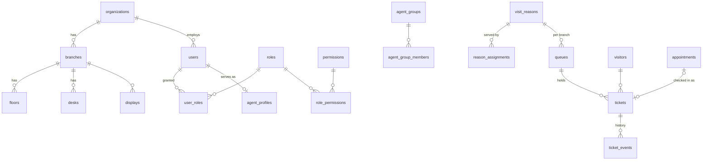

# Data model

Source of truth: `src/db/schema/*.ts`. The SQL is generated into `drizzle/`.

**Conventions**

- Primary keys are UUIDs.
- Timestamps are `timestamptz` (UTC).
- Translatable text is JSONB `{ "<locale>": "…" }`.
- Configuration rows are archived (`archived_at`), never hard-deleted, once history references them.
- Every row carries `organization_id`; branch data also carries `branch_id`.

## Tenancy and locations

| Table           | Purpose                                                                          |
| --------------- | -------------------------------------------------------------------------------- |
| `organizations` | Tenant: name, slug, default locale, enabled locales                              |
| `cities`        | Groups branches; access can be granted per city                                  |
| `branches`      | Office: `city_id`, code, name, **timezone**, **weekend days**                    |
| `floors`        | Optional grouping of desks                                                       |
| `desks`         | Counter/office; `number` is announced ("Desk 3"); `zone` for multi-zone displays |

## Identity and access

| Table                   | Purpose                                                                                                                                                            |
| ----------------------- | ------------------------------------------------------------------------------------------------------------------------------------------------------------------ |
| `users`                 | Email (unique per org), bilingual display name, argon2id hash, encrypted TOTP secret, lockout counters, `is_active`                                                |
| `user_avatars`          | Processed profile picture (256x256 webp, bytea) per user; `users.avatar_version` is its cache key                                                                  |
| `brand_assets`          | Uploaded brand image per organization and kind (`logo`, `logo_dark`): processed png (bytea), content type, `version` as the cache key of the public URL            |
| `sessions`              | `id` = SHA-256(cookie token), expiry, `two_factor_verified`, IP, user agent                                                                                        |
| `oidc_accounts`         | (provider, subject) → user, for SSO                                                                                                                                |
| `permissions`           | Catalogue synced from code                                                                                                                                         |
| `roles`                 | `is_system` for the built-in roles (admin, receptionist, agent)                                                                                                    |
| `role_permissions`      | Role ↔ permission                                                                                                                                                  |
| `user_roles`            | User ↔ role with a scope: `branch_id` (one branch), `city_id` (every branch of a city) or neither (whole organization); never both; unique with NULLS NOT DISTINCT |
| `invites`               | Hashed single-use token, role, branch, channel, expiry, `used_at`, `revoked_at`                                                                                    |
| `password_reset_tokens` | Hashed single-use tokens                                                                                                                                           |
| `api_keys`              | Hashed keys with permission list and optional branch scope                                                                                                         |

## Agents

| Table                 | Purpose                                                                                                            |
| --------------------- | ------------------------------------------------------------------------------------------------------------------ |
| `agent_profiles`      | Status (AVAILABLE/BUSY/ON_BREAK/AWAY/OFFLINE), current/default desk, `max_concurrent`, `weight`, `last_idle_since` |
| `agent_groups`        | Departments with an optional supervisor                                                                            |
| `agent_group_members` | Group ↔ user                                                                                                       |
| `break_types`         | Configurable break types (prayer, lunch, meeting, training) with max minutes                                       |
| `agent_status_log`    | Every status change; the source for login, break, idle and utilisation KPIs                                        |

## Services and distribution

| Table                | Purpose                                                                                                                                                                                                       |
| -------------------- | ------------------------------------------------------------------------------------------------------------------------------------------------------------------------------------------------------------- |
| `visit_reasons`      | Name, icon, colour, **prefix** (Latin or Arabic), default priority, expected service minutes, SLA target wait, `intake_fields`, appointments allowed, schedule, cut-off, featured/shortcut for fast reception |
| `reason_assignments` | Reason → agent **or** group, proficiency 1–5, primary/backup, optional branch                                                                                                                                 |
| `queues`             | Reason × branch: prefix override, number range                                                                                                                                                                |
| `distribution_rules` | Mode, strategies and ordering config as validated JSON; scope global → branch → queue; versioned                                                                                                              |
| `priority_levels`    | Data-driven lanes/flags (VIP/guest, elderly, disabled, pregnant, ladies/families, urgent) with weight                                                                                                         |
| `ticket_counters`    | (branch, prefix, service_day) → last number, incremented under a row lock                                                                                                                                     |

## Tickets

| Table            | Purpose                                                                                                                                                                                                                       |
| ---------------- | ----------------------------------------------------------------------------------------------------------------------------------------------------------------------------------------------------------------------------- |
| `visitors`       | Minimal PII (name, phone, company), normalized/transliterated name, **phone HMAC hash**, visit count, last agent, `anonymized_at`                                                                                             |
| `appointments`   | Pre-booked visits with a lookup code, check-in → ticket                                                                                                                                                                       |
| `tickets`        | Number/prefix/`display_number`, `service_day`, status, priority, language, `public_token` (status page), assigned/serving agent, desk, `arrived_at` (kept on transfer), timestamps, intake values, idempotency key, `version` |
| `ticket_events`  | Append-only: every transition, with from/to status, actor, agent, desk, queue, payload. **Reports read from here.**                                                                                                           |
| `csat_responses` | One per completed ticket (unique): agent, reason, score 1–5, optional NPS 0–10, comment (max 500, personal data, erased with the visit), channel (`status_page`, `link`, `kiosk`), language, `at`. See D53                    |

**Ticket states:** `APPOINTMENT_PENDING`, `WAITING`, `CALLED`, `SERVING`, `ON_HOLD`, `COMPLETED`, `NO_SHOW`, `CANCELLED`. A transfer is an event (`TRANSFERRED`) that returns the ticket to `WAITING` in another queue with its original `arrived_at`.

## Devices and messaging

| Table               | Purpose                                                                                                                                                                                                                                                                                  |
| ------------------- | ---------------------------------------------------------------------------------------------------------------------------------------------------------------------------------------------------------------------------------------------------------------------------------------- |
| `displays`          | Paired device: hashed token, pairing code, layout, config (languages, voice overrides: enabled/volume/rate/callLanguages/repeat, ticker, `theme`: `default`/`dark`/`light`/`brand`), last seen, `revoked_at`                                                                             |
| `announcements`     | Ticker lines and slides, scheduled                                                                                                                                                                                                                                                       |
| `message_templates` | Per channel (voice, sms, whatsapp, email, ticket_print, display) x event, bilingual body with placeholders; `provider_template` = approved WhatsApp template name                                                                                                                        |
| `notifications_log` | Outbound messages: masked recipient, status (`queued`, `sending`, `sent`, `failed`, `skipped` with the reason in `error`), `attempts`, `next_attempt_at` (due time and lease), unique `dedupe_key` (`<ticket>:<event>`), `payload` (non-personal variables, channel chain, retry cursor) |
| `tts_audio_packs`   | Pre-recorded clip manifests for kiosks without an Arabic TTS voice                                                                                                                                                                                                                       |

## Platform

| Table              | Purpose                                                    |
| ------------------ | ---------------------------------------------------------- |
| `settings`         | Typed key/value per organization, optional branch override |
| `audit_logs`       | Actor, action, entity, before/after (secrets scrubbed), IP |
| `alerts`           | Anomaly alerts with dedupe key and acknowledgement         |
| `report_schedules` | Scheduled report emails                                    |
| `webhooks`         | Outbound integration hooks                                 |
| `idempotency_keys` | Stored responses for retried POSTs                         |
