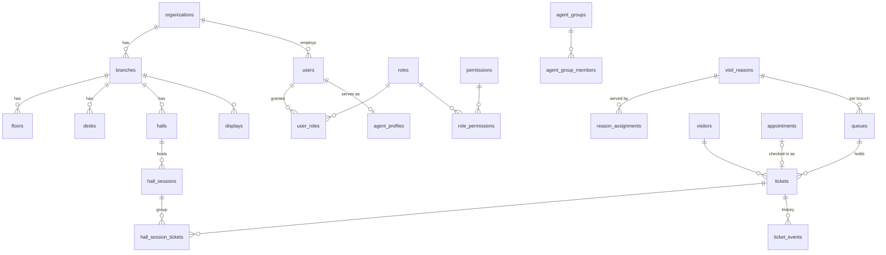

# Data model

Source of truth: `src/db/schema/*.ts`. The SQL is generated into `drizzle/`.

**Conventions**

- Primary keys are UUIDs.
- Timestamps are `timestamptz` (UTC).
- Translatable text is JSONB `{ "<locale>": "…" }`.
- Configuration rows are archived (`archived_at`), never hard-deleted, once history references them.
- Every row carries `organization_id`; branch data also carries `branch_id`.

## Tenancy and locations

| Table           | Purpose                                                                                                                                                               |
| --------------- | --------------------------------------------------------------------------------------------------------------------------------------------------------------------- |
| `organizations` | Tenant: name, slug, default locale, enabled locales                                                                                                                   |
| `cities`        | Groups branches; access can be granted per city                                                                                                                       |
| `branches`      | Office: `city_id`, code, name, **timezone**, **weekend days**                                                                                                         |
| `floors`        | Optional grouping of desks                                                                                                                                            |
| `desks`         | Counter/office; `number` is announced ("Desk 3"); `zone` for multi-zone displays                                                                                      |
| `halls`         | Room with a `capacity` (>= 2) where one host receives a group together (D62); `number` is announced ("Hall 2"); `zone`; unique `number` per branch among active halls |

## Identity and access

| Table                   | Purpose                                                                                                                                                            |
| ----------------------- | ------------------------------------------------------------------------------------------------------------------------------------------------------------------ |
| `users`                 | Email (unique per org), bilingual display name, argon2id hash, encrypted TOTP secret, lockout counters, `is_active`                                                |
| `user_avatars`          | Processed profile picture (256x256 webp, bytea) per user; `users.avatar_version` is its cache key                                                                  |
| `brand_assets`          | Uploaded brand image per organization and kind (`logo`, `logo_dark`): processed png (bytea), content type, `version` as the cache key of the public URL            |
| `sessions`              | `id` = SHA-256(cookie token), expiry, `two_factor_verified`, IP, user agent                                                                                        |
| `oidc_accounts`         | (provider, subject) → user, for SSO                                                                                                                                |
| `permissions`           | Catalogue synced from code                                                                                                                                         |
| `roles`                 | `is_system` for the built-in roles (admin, receptionist, agent)                                                                                                    |
| `role_permissions`      | Role ↔ permission                                                                                                                                                  |
| `user_roles`            | User ↔ role with a scope: `branch_id` (one branch), `city_id` (every branch of a city) or neither (whole organization); never both; unique with NULLS NOT DISTINCT |
| `invites`               | Hashed single-use token, role, branch, channel, expiry, `used_at`, `revoked_at`                                                                                    |
| `password_reset_tokens` | Hashed single-use tokens                                                                                                                                           |
| `api_keys`              | Hashed keys with permission list and optional branch scope                                                                                                         |

## Agents

| Table                 | Purpose                                                                                                            |
| --------------------- | ------------------------------------------------------------------------------------------------------------------ |
| `agent_profiles`      | Status (AVAILABLE/BUSY/ON_BREAK/AWAY/OFFLINE), current/default desk, `max_concurrent`, `weight`, `last_idle_since` |
| `agent_groups`        | Departments with an optional supervisor                                                                            |
| `agent_group_members` | Group ↔ user                                                                                                       |
| `break_types`         | Configurable break types (prayer, lunch, meeting, training) with max minutes                                       |
| `agent_status_log`    | Every status change; the source for login, break, idle and utilisation KPIs                                        |

## Services and distribution

| Table                | Purpose                                                                                                                                                                                                       |
| -------------------- | ------------------------------------------------------------------------------------------------------------------------------------------------------------------------------------------------------------- |
| `visit_reasons`      | Name, icon, colour, **prefix** (Latin or Arabic), default priority, expected service minutes, SLA target wait, `intake_fields`, appointments allowed, schedule, cut-off, featured/shortcut for fast reception |
| `reason_assignments` | Reason → agent **or** group, proficiency 1–5, primary/backup, optional branch                                                                                                                                 |
| `queues`             | Reason × branch: prefix override, number range                                                                                                                                                                |
| `distribution_rules` | Mode, strategies and ordering config as validated JSON; scope global → branch → queue; versioned                                                                                                              |
| `priority_levels`    | Data-driven lanes/flags (VIP/guest, elderly, disabled, pregnant, ladies/families, urgent) with weight                                                                                                         |
| `ticket_counters`    | (branch, prefix, service_day) → last number, incremented under a row lock                                                                                                                                     |

## Tickets

| Table              | Purpose                                                                                                                                                                                                                                                                                                                                                     |
| ------------------ | ----------------------------------------------------------------------------------------------------------------------------------------------------------------------------------------------------------------------------------------------------------------------------------------------------------------------------------------------------------- |
| `visitors`         | Minimal PII (name, phone, company), normalized/transliterated name, **phone HMAC hash**, visit count, last agent, `anonymized_at`                                                                                                                                                                                                                           |
| `appointments`     | Pre-booked visits with a lookup code, check-in → ticket                                                                                                                                                                                                                                                                                                     |
| `tickets`          | Number/prefix/`display_number`, `service_day`, status, priority, language, `public_token` (status page), assigned/serving agent, desk, `arrived_at` (kept on transfer), timestamps, intake values, idempotency key, `version`                                                                                                                               |
| `ticket_events`    | Append-only: every transition, with from/to status, actor, agent, desk, queue, payload. **Reports read from here.**                                                                                                                                                                                                                                         |
| `csat_responses`   | One per completed ticket (unique): agent, reason, score 1–5, optional NPS 0–10, comment (max 500, personal data, erased with the visit), channel (`status_page`, `link`, `kiosk`), language, `at`. See D53. The desk where the visit was served is the ticket's own `desk_id` (kept after completion), used by the wallboard's negative-ratings panel (D65) |
| `privacy_requests` | Data-subject requests and staff anonymisations (D56): `type` access or erasure, `status`, `subject_kind` visitor or user, `subject_ref` (keyed hash of the id, never a name or number), `requested_at`, `completed_at`, `performed_by`, `note` (the reason), `summary` (counts)                                                                             |

**Ticket states:** `APPOINTMENT_PENDING`, `WAITING`, `CALLED`, `SERVING`, `ON_HOLD`, `COMPLETED`, `NO_SHOW`, `CANCELLED`. A transfer is an event (`TRANSFERRED`) that returns the ticket to `WAITING` in another queue with its original `arrived_at`.

## Devices and messaging

| Table               | Purpose                                                                                                                                                                                                                                                                                  |
| ------------------- | ---------------------------------------------------------------------------------------------------------------------------------------------------------------------------------------------------------------------------------------------------------------------------------------- |
| `displays`          | Paired device: hashed token, pairing code, kind (`display` or `kiosk`, D61), layout, config (languages, voice overrides: enabled/volume/rate/callLanguages/repeat, ticker, `theme`: `default`/`dark`/`light`/`brand`), last seen, `revoked_at`                                           |
| `announcements`     | Ticker lines and slides, scheduled                                                                                                                                                                                                                                                       |
| `message_templates` | Per channel (voice, sms, whatsapp, email, ticket_print, display) x event, bilingual body with placeholders; `provider_template` = approved WhatsApp template name                                                                                                                        |
| `notifications_log` | Outbound messages: masked recipient, status (`queued`, `sending`, `sent`, `failed`, `skipped` with the reason in `error`), `attempts`, `next_attempt_at` (due time and lease), unique `dedupe_key` (`<ticket>:<event>`), `payload` (non-personal variables, channel chain, retry cursor) |
| `tts_audio_packs`   | Pre-recorded clip manifests for kiosks without an Arabic TTS voice                                                                                                                                                                                                                       |

## Platform

| Table              | Purpose                                                                                                                               |
| ------------------ | ------------------------------------------------------------------------------------------------------------------------------------- |
| `settings`         | Typed key/value: organization default, optional `city_id` override or `branch_id` override (never both); the most specific wins (D60) |
| `city_reasons`     | Reasons a city has switched off (`enabled = false`); no row = enabled (D60)                                                           |
| `audit_logs`       | Actor, action, entity, before/after (secrets scrubbed), IP                                                                            |
| `alerts`           | Anomaly alerts with dedupe key and acknowledgement                                                                                    |
| `report_schedules` | Scheduled report emails                                                                                                               |
| `webhooks`         | Outbound integration hooks                                                                                                            |
| `idempotency_keys` | Stored responses for retried POSTs                                                                                                    |

## Retention and anonymisation (D56)

What the nightly job, an erasure request and a staff anonymisation do. All periods are in settings group `privacy`; 0 keeps forever.

| Data                                                                                             | After                                                 | Action                                                                                                                                             |
| ------------------------------------------------------------------------------------------------ | ----------------------------------------------------- | -------------------------------------------------------------------------------------------------------------------------------------------------- |
| `visitors` name, `name_search`, `name_translit`, `phone`, `phone_hash`, company, `last_agent_id` | last visit, `retentionDays` (365)                     | set to null, `anonymized_at` stamped. Row, `visit_count`, `last_visit_at` stay; the person can no longer be re-linked (a later visit is a new row) |
| `tickets.intake`, `tickets.notes`, `appointments.notes`                                          | finished ticket / appointment, `ticketDataDays` (365) | `{}` / null. Ticket, status, times, outcome, tags stay                                                                                             |
| `csat_responses.comment`                                                                         | `commentDays` (365)                                   | null. Score, NPS, channel stay                                                                                                                     |
| `notifications_log.recipient_masked`, `payload`                                                  | `notificationDays` (90), not queued/sending           | null / `{}`. Status, channel, event, times stay                                                                                                    |
| `audit_logs`                                                                                     | `auditDays` (365)                                     | deleted; security-critical actions never before 365 days, others never before 30                                                                   |
| `sessions`, `invites`, `password_reset_tokens`, `displays.pairing_code`                          | `credentialDays` (30) after expiry                    | deleted (pairing code and expiry cleared)                                                                                                          |
| `idempotency_keys`                                                                               | 24 hours                                              | deleted                                                                                                                                            |

Staff: `users.anonymized_at` marks a deactivated account whose email, name, phone, password, 2FA secret, picture, OIDC links and sessions were removed. The row, id, grants, shifts, served tickets and audit entries (without name/email snapshots, IP and browser) stay.

Shifts (`shifts.city_id`) and message templates (`message_templates.city_id`) are organization-wide when `city_id` is null and belong to one city otherwise (D60).

## Self check-in (D61)

`visit_reasons.requires_staff` (boolean, default false) hides a reason from the kiosk ("please ask the agent"). Intake fields (JSON on the reason) may carry `selfService` (boolean; unset = default by key). `tickets.source` takes `reception`, `agent`, `kiosk`, `appointment` or `api`. Settings `reception.agentIssuing` and the `selfCheckin` group resolve organization, city, branch like other settings. Permission `tickets.issue_self`.

## Page content (D66, no migration)

The wording and options of the kiosk and of the visitor page are the JSON setting `pageContent` in `settings` (organization, `city_id` or `branch_id` row, resolved like every setting, D60). Only changed texts are stored (`kiosk.texts` and `visitor.texts`: `{ id: { ar?, en? } }`); the defaults stay in the message files and the catalogue (`src/domain/pagecontent/catalog.ts`) maps ids to message paths. Saved ids are never removed from the catalogue.

## Halls (D62, migration 0018)

| Table / column                       | Purpose                                                                                                                                                                                                                                 |
| ------------------------------------ | --------------------------------------------------------------------------------------------------------------------------------------------------------------------------------------------------------------------------------------- |
| `halls`                              | See Tenancy. Archived, never deleted                                                                                                                                                                                                    |
| `hall_reasons`                       | Hall-delivered reasons a hall accepts; no rows = all of them                                                                                                                                                                            |
| `hall_sessions`                      | One group session: hall, host, status `OPEN` / `IN_SESSION` / `CLOSED` / `CANCELLED`, capacity snapshot, `reason_id`, `called_at`, `started_at`, `closed_at`, `outcome`. Partial unique indexes: one live session per hall and per host |
| `hall_session_tickets`               | A visitor in a session: `CALLED` / `ENTERED` / `NO_SHOW` / `DONE` / `RELEASED`, with `called_at`, `entered_at`, `finished_at`, `outcome`; unique per session and ticket                                                                 |
| `visit_reasons.delivery`             | `desk` (default) or `hall`: hall reasons are served only by hall sessions and never auto-assigned to desk agents                                                                                                                        |
| `agent_profiles.current_hall_id`     | The hall the agent is signed in to as host (an agent is at a desk or a hall, never both); `default_hall_id` is the hall they usually host                                                                                               |
| `tickets.hall_id`, `hall_session_id` | The hall and session a visitor is in; cleared when the visitor goes back to the queue, kept as history after the visit                                                                                                                  |

Ticket statuses are unchanged; a session maps onto them (call = CALLED, enter = SERVING, close = COMPLETED / NO_SHOW). Ticket events of a hall visit carry `{hallId, sessionId}` in the payload; sending a visitor back is the event `HALL_RELEASED`.
